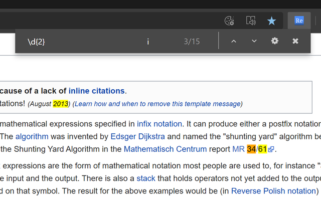

# edge-regex-search
Search with regex in Microsoft Edge. 

# Privacy Policy
## Stored Data
No data is collected or stored by this extension except the extension settings which are synced across your devices using the browsers internal syncing capabilites (if it's activated). Data is not synced to a cloud service or to a third party local or remote application. 

## Browser permission 
This extension requires access to certain permissions from your browser. These permissions are carefully selected, and Regex search would not function without these. The following permissions are required: 
- "activeTab"
To execute search and highlighting scripts in the active tab.

## License
Please refer to the file named "LICENSE".

## Contact 
Please use Github to report/ask or discuss this web extension's features, questions about the privacy policy or other matters. 